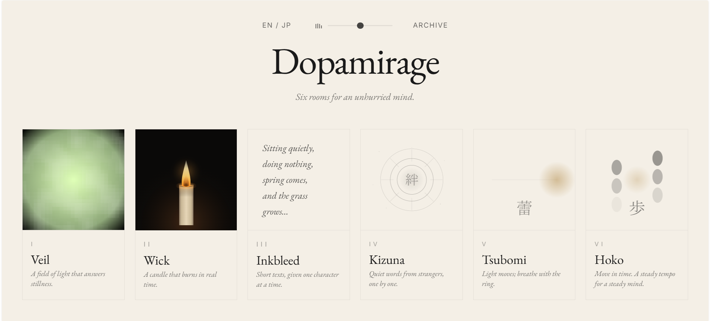

<div align="center">

# Dopamirage

*Six quiet rooms for a brain on too many feeds.*

<br>

<!-- screenshot of the portal goes here -->


<br><br>

[](#)
[](#)
[](#)
[](LICENSE)

[**Open the rooms →**](https://dopamirage.vercel.app)

</div>

<br>

---

## What it is

A non-stimulant digital space. Six rooms in a single web page, each doing exactly one thing. Slowly.

No accounts. No notifications. No analytics. No build step. No backend. Drop the HTML file on a static host and you have the whole thing.

The name is **dopamine** + **mirage** — the small illusion of reward that feeds produce, and what dissolves when attention returns.

<br>

---

## The rooms

| | | |
|---|---|---|
| **Veil**     · 一  | A field of light that answers stillness.                | Ganzfeld field. The longer you don't move, the more you see. |
| **Wick**     · 二  | A candle that burns in real time.                       | Long-form timer. Survives tab close, page reload, overnight. |
| **Inkbleed** · 三  | Short texts, given one character at a time.            | Slow reading with character-paced reveal. |
| **Kizuna**   · 四  | Quiet words from strangers, one by one.                | Bloom-paced quote stream + a one-line anonymous note you can leave behind. |
| **Tsubomi**  · 五  | Light moves; breathe with the ring.                    | Box breathing paired with bilateral horizontal motion. |
| **Hoko**     · 六  | Move in time. A steady tempo for a steady mind.        | Bilateral metronome for walking / jogging / jumping in Zone-2 cadence. |

<br>

---

## Why

The screens we carry are designed to predict the next moment you'll want to look. The prediction is usually wrong; it just needs to be close enough that your hand moves anyway.

This is a small, undefended space where that loop doesn't run.

Each room is grounded in something concrete:

- **Veil** — Ganzfeld stimulation reduces task-positive cortical activity.
- **Wick** — Temporal anchoring. A candle is a clock that costs nothing to glance at.
- **Inkbleed** — Depth-of-processing reading. Slow reveals encourage subvocalization.
- **Kizuna** — Mere-witnessing of unhurried language as an alternative to feed-paced text.
- **Tsubomi** — Box breathing at ≈0.15 Hz (the baroreflex resonance peak) plus bilateral pacing.
- **Hoko** — Sustained movement in the BDNF-supportive Zone-2 cadence band (110–140 BPM).

None of these are miracles. They are just things that the body responds to when it has time to.

<br>

---

## Run it

```bash
git clone https://github.com/<your-org>/dopamirage.git
cd dopamirage
# any static server will do
python3 -m http.server 8000
# → http://localhost:8000
```

Or just open `index.html` in a browser. It's one file.

To deploy: copy `index.html` anywhere. GitHub Pages, Netlify, an SD card. The HTML is self-contained except for two CDN links (Tailwind, Google Fonts) — both can be inlined for fully offline operation.

<br>

---

## Stack

- **Vanilla JavaScript.** No framework, no transpiler, no package.json that matters.
- **HTML Canvas 2D** for everything visual (Veil's field, Wick's flame, Kizuna's blooms, Tsubomi's pulse, Hoko's landscape).
- **Web Audio API** for everything audible — no audio files are bundled. Bells, woodblocks, candle crackle and breath pads are all synthesized at runtime.
- **localStorage** for session state. There is no server. There has never been a server.
- **Tailwind CDN + Google Fonts** as the only externals. Roughly 500 KB of single-file HTML.

<br>

---

## Project structure

```
dopamirage/
├── index.html          # the whole application
├── README.md
├── LICENSE
└── docs/
    ├── screenshot-portal.png
    ├── screenshot-veil.png
    └── …
```

That's it. `index.html` contains the markup, every room's module, the audio engine, the i18n table, the state persistence layer, and the design tokens. It is intentionally legible top-to-bottom.

<br>

---

## Design principles

These are not aspirations — they are constraints that have been applied to every decision in the codebase.

| Principle | What it means in practice |
|---|---|
| **No dark patterns.** | No streak loss. No FOMO timers. No “you'll lose your progress.” Closing the tab is supported, not punished. |
| **No telemetry.** | We do not know that you visited. We will not know. |
| **No accounts.** | Everything is in `localStorage`. Clear it, and Dopamirage forgets. |
| **No motion you didn't ask for.** | Sounds and animations begin on a user gesture, never on page load. The visible default state is silent. |
| **Public-domain content only.** | Every quote in Inkbleed and Kizuna is from an author who died at least 70 years ago. No licensing landmines. |
| **One file.** | Discoverable. Auditable. Archivable. |

<br>

---

## Contributing

Pull requests are welcome but should pass the room's smell test:

- Does it make Dopamirage **quieter**, or louder?
- Does it remove a feature, or add one?
- Does it keep the file count at one?

Bug reports and translation contributions (currently 日本語 / English) are the most useful kind of help. New rooms are discouraged unless they earn their place — six is already a lot to hold attention across.

<br>

---

## Acknowledgements

The texts in **Inkbleed** and **Kizuna** are drawn from authors whose work has passed into the public domain. Among them: Bashō, Issa, Sei Shōnagon, Lao Tzu, Saigyō, Walt Whitman, Emily Dickinson, Marcus Aurelius, Rilke, Rumi, Lincoln, Darwin, Newton, Curie, Beethoven, and the shogi masters Amano Sōho, Sakata Sankichi, Sekine Kinjirō.

No quote was paraphrased or invented. Profession tags and traditional-attribution markers were removed for visual quiet.

<br>

---

## License

MIT for code. Public domain for the quoted material.

Use it. Fork it. Ship your own version with rooms we never imagined.

<br>

<div align="center">

— *built slowly, and quietly* —

</div>
